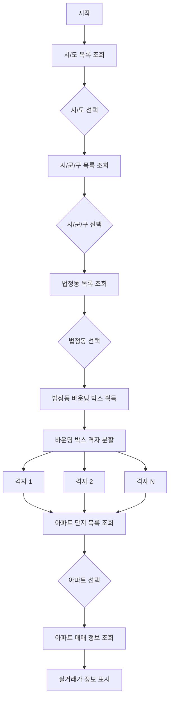

# 아파트 실거래가 데이터 조회 흐름

## 1. 전체 흐름 요약

```
시/도 목록 → 시/군/구 목록 → 법정동 코드 → 바운딩 박스 → 격자 분할 → 아파트 단지 목록 → 아파트 매매 정보
```

## 2. 단계별 상세 흐름

### 2.1 시/도 목록 조회

**API 호출:**
```http
GET https://api.hogangnono.com/area/sidos
```

**응답 예시:**
```json
{
  "sidos": [
    {
      "sidoCode": 11,
      "sidoName": "서울특별시"
    },
    {
      "sidoCode": 41,
      "sidoName": "경기도"
    }
  ]
}
```

### 2.2 시/군/구 목록 조회

**API 호출:**
```http
GET https://api.hogangnono.com/area/guguns?sidoCode=11
```

**응답 예시:**
```json
{
  "guguns": [
    {
      "gugunCode": 11000,
      "gugunName": "종로구"
    },
    {
      "gugunCode": 11020,
      "gugunName": "중구"
    }
  ]
}
```

### 2.3 법정동 코드 목록 조회

**API 호출:**
```http
GET https://api.hogangnono.com/area/dongs?sidoCode=11&gugunCode=11020
```

**응답 예시:**
```json
{
  "dongs": [
    {
      "dongCode": "1111010100",
      "dongName": "소공동",
      "lon": "126.9818235",
      "lat": "37.5622236",
      "boundingBox": {
        "minLon": "126.975693",
        "maxLon": "126.987954",
        "minLat": "37.557436",
        "maxLat": "37.567011"
      }
    }
  ]
}
```

### 2.4 바운딩 박스 정보 기반 격자 분할

법정동의 바운딩 박스를 여러 개의 격자로 분할하여 600개 제한을 우회합니다.

**격자 분할 알고리즘:**
```python
def divide_bounding_box(bbox):
    # 격자 크기 설정 (보통 0.005도 단위로 분할)
    grid_size = 0.005

    min_lon = float(bbox['minLon'])
    max_lon = float(bbox['maxLon'])
    min_lat = float(bbox['minLat'])
    max_lat = float(bbox['maxLat'])

    grids = []
    current_lon = min_lon
    while current_lon < max_lon:
        next_lon = min(current_lon + grid_size, max_lon)
        current_lat = min_lat
        while current_lat < max_lat:
            next_lat = min(current_lat + grid_size, max_lat)
            grids.append({
                'minLon': current_lon,
                'maxLon': next_lon,
                'minLat': current_lat,
                'maxLat': next_lat
            })
            current_lat = next_lat
        current_lon = next_lon

    return grids
```

### 2.5 각 격자별 아파트 단지 목록 조회

**API 호출 (각 격자별):**
```http
GET https://api.hogangnono.com/search/apartments?minLon=126.975693&maxLon=126.985693&minLat=37.557436&maxLat=37.567436&pageNo=1
```

**응답 예시:**
```json
{
  "totalCount": 50,
  "apartments": [
    {
      "aptDong": "101동",
      "aptName": "압구정현대",
      "buildYear": "1978",
      "courtCount": 9,
      "dong": "청담동",
      "hoCount": 881,
      "jibun": "238-1",
      "latitude": "37.518524",
      "longitude": "127.047637",
      "lowType": "아파트",
      "siDo": "서울특별시",
      "sigungu": "강남구",
      "umd": "청담동"
    }
  ]
}
```

### 2.6 아파트 상세 매매 정보 조회

**API 호출:**
```http
GET https://api.hogangnono.com/trade/apt?sidoCode=11&sigunguCode=11110&bjdongCode=10300&aptName=압구정현대&buildYear=1978&pageNo=1
```

**응답 예시:**
```json
{
  "totalCount": 20,
  "trades": [
    {
      "dealAmount": "260000",
      "dealDay": "17",
      "dealMonth": "10",
      "dealYear": "2023",
      "areaForExclusiveUse": "84.97",
      "floor": "5",
      "aptName": "압구정현대"
    }
  ]
}
```

## 3. 데이터 흐름 플로우차트



## 4. 파라미터 매핑 표

| 단계 | 필요한 파라미터 | 다음 단계로 전달 |
|------|----------------|------------------|
| 1. 시/도 목록 | - | sidoCode |
| 2. 시/군/구 목록 | sidoCode | sidoCode, gugunCode |
| 3. 법정동 목록 | sidoCode, gugunCode | dongCode, bbox |
| 4. 격자 분할 | bbox | 각 격자의 minLon, maxLon, minLat, maxLat |
| 5. 아파트 목록 | 격자 좌표 | aptName, buildYear, sidoCode, sigunguCode, bjdongCode |
| 6. 매매 정보 | aptName, buildYear, sidoCode, sigunguCode, bjdongCode | 최종 실거래가 정보 |

## 5. 600개 제한 우회 전략 상세

### 5.1 격자 크기 최적화
- **최적 격자 크기**: 약 0.005도 (500m) 단위로 분할
- **계산식**: (maxLon - minLon) * (maxLat - minLat) / 0.000025 ≈ 격자 수
- **예시**: 1km² 지역 → 약 4개 격자로 분할

### 5.2 격자별 쿼리 수
- **작은 지역**: 4~16개 격자
- **중간 지역**: 25~100개 격자
- **큰 지역**: 100~500개 격자

### 5.3 동시 처리 전략
```python
import asyncio
import aiohttp

async def fetch_all_grids(grids):
    async with aiohttp.ClientSession() as session:
        tasks = []
        for grid in grids:
            task = fetch_apartments_for_grid(session, grid)
            tasks.append(task)
        results = await asyncio.gather(*tasks)
        return merge_results(results)
```

## 6. 실제 구현 예제

```javascript
// 전체 흐름 구현 예제
class AptTradeCrawler {
    constructor() {
        this.apiBase = 'https://api.hogangnono.com';
    }

    async crawlApartments(sidoCode, gugunCode, dongCode) {
        // 1. 법정동 정보 조회
        const dongInfo = await this.getDongInfo(dongCode);

        // 2. 바운딩 박스 격자 분할
        const grids = this.divideBoundingBox(dongInfo.boundingBox);

        // 3. 모든 격자에서 아파트 조회
        const allApartments = [];
        for (const grid of grids) {
            const apartments = await this.getApartmentsInGrid(grid);
            allApartments.push(...apartments);
        }

        // 4. 중복 제거
        const uniqueApartments = this.removeDuplicates(allApartments);

        // 5. 각 아파트의 매매 정보 조회
        const results = [];
        for (const apt of uniqueApartments) {
            const trades = await this.getTrades(apt);
            results.push({
                apartment: apt,
                trades: trades
            });
        }

        return results;
    }

    divideBoundingBox(bbox) {
        const grids = [];
        const gridSize = 0.005;

        for (let lon = parseFloat(bbox.minLon);
             lon < parseFloat(bbox.maxLon);
             lon += gridSize) {
            for (let lat = parseFloat(bbox.minLat);
                 lat < parseFloat(bbox.maxLat);
                 lat += gridSize) {
                grids.push({
                    minLon: lon,
                    maxLon: Math.min(lon + gridSize, parseFloat(bbox.maxLon)),
                    minLat: lat,
                    maxLat: Math.min(lat + gridSize, parseFloat(bbox.maxLat))
                });
            }
        }

        return grids;
    }
}
```

## 7. 주의사항 및 최적화 팁

1. **API 호출 간격**: API 서버 부하를 고려하여 적절한 지연 추가 (최소 100ms)
2. **캐싱 전략**: 법정동 정보와 바운딩 박스는 캐싱하여 재사용
3. **에러 처리**: 429 Too Many Requests 에러 시 재시도 로직 구현
4. **데이터 정합성**: 다른 격자에서 중복으로 조회된 아파트는 제거 필요
5. **좌표계 확인**: WGS84 좌표계 사용 확인 (대부분의 경우 기본값)

## 8. 완전한 조회 시나리오 예시

**목표**: 서울특별시 강남구 청담동의 압구정현대 아파트 실거래가 조회

1. **시/도**: 서울특별시 (sidoCode: 11)
2. **시/군/구**: 강남구 (gugunCode: 11680)
3. **법정동**: 청담동 (dongCode: 1168010300)
4. **바운딩 박스**: minLon=127.047637, maxLon=127.057637, minLat=37.518524, maxLat=37.528524
5. **격자 분할**: 4개 격자로 분할
6. **아파트 조회**: 각 격자별 API 호출 → 압구정현대 발견
7. **매매 정보**: aptName="압구정현대", buildYear="1978"로 최종 조회
8. **결과**: 해당 아파트의 최근 실거래가 정보 획득
