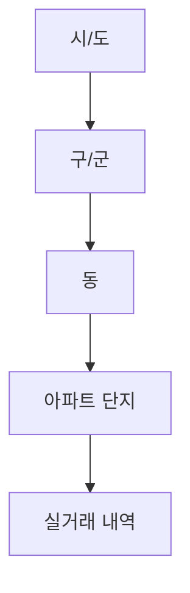

# 호갱노노 API v2 가이드

> 부동산 실거래 데이터 조회를 위한 비공식 API 가이드

## 목차

1. [Quick Start](#quick-start)
2. [인증 및 설정](#인증-및-설정)
3. [API 레퍼런스](#api-레퍼런스)
   - [3.1. 지역 정보 조회](#31-지역-정보-조회)
   - [3.2. 아파트 단지 목록 조회](#32-아파트-단지-목록-조회)
   - [3.3. 실거래 내역 조회](#33-실거래-내역-조회)
4. [가이드 및 튜토리얼](#가이드-및-튜토리얼)
   - [4.1. 바운딩 박스 활용 전략](#41-바운딩-박스-활용-전략)
   - [4.2. 대용량 데이터 처리 팁](#42-대용량-데이터-처리-팁)
5. [에러 처리](#에러-처리)
6. [부록](#부록)

## Quick Start

5분 만에 API를 시작해보세요:

```python
import requests

# 1. 세션 초기화
session = requests.Session()
session.get("https://hogangnono.com")

# 2. 지역 정보 조회
regions_response = session.get(
    "https://hogangnono.com/api/v2/regions",
    headers={
        "X-Requested-With": "XMLHttpRequest",
        "Referer": "https://hogangnono.com/",
        "Origin": "https://hogangnono.com"
    }
)

# 3. 강남구 아파트 목록 조회
apts_response = session.get(
    "https://hogangnono.com/api/v2/pois-bounding",
    params={
        "startX": 127.04,
        "endX": 127.12,
        "startY": 37.48,
        "endY": 37.52,
        "level": 14,
        "apt": ""  # 필수 파라미터
    },
    headers={
        "X-Requested-With": "XMLHttpRequest",
        "Referer": "https://hogangnono.com/",
        "Origin": "https://hogangnono.com"
    }
)

print(f"지역 수: {len(regions_response.json()['data']['regionList'])}")
print(f"아파트 수: {len(apts_response.json()['data'])}")
```

## 인증 및 설정

### 기본 정보
- **기본 URL**: `https://hogangnono.com`
- **API 버전**: v2
- **인증 방식**: 세션 쿠키 기반
- **지원 프로토콜**: HTTPS만 지원
- **데이터 형식**: JSON

### 세션 초기화 절차
1. 메인 페이지에 최초 접속하여 세션 쿠키 발급
2. 이후 모든 API 요청에 발급된 쿠키 자동 포함

### 필수 요청 헤더
| 헤더 | 값 | 설명 |
|-----|----|------|
| X-Requested-With | XMLHttpRequest | AJAX 요청임을 명시 (필수) |
| Referer | https://hogangnono.com/ | 참조 페이지 (필수) |
| Origin | https://hogangnono.com | 출처(origin) (권장) |
| Content-Type | application/json | POST 요청 시 (필수) |
| User-Agent | Mozilla/5.0... | 브라우저 UA (권장) |

### Rate Limiting
- 요청 간격: **1-2초** 이상 권장
- 연속 요청 시 429 에러 가능성
- 대용량 데이터 수집 시 간격 조정 필수

### 데이터 흐름


## API 레퍼런스

### 3.1. 지역 정보 조회

전국의 시/도 및 구/군 정보를 조회합니다.

#### 엔드포인트
```
GET /api/v2/regions
```

#### cURL 예제
```bash
curl -X GET "https://hogangnono.com/api/v2/regions" \
  -H "X-Requested-With: XMLHttpRequest" \
  -H "Referer: https://hogangnono.com/" \
  -H "Origin: https://hogangnono.com"
```

#### 응답
```json
{
  "data": {
    "regionList": [
      {
        "regionCode": "11",
        "name": "서울",
        "fullName": "서울특별시",
        "children": [
          {
            "regionCode": "11110",
            "name": "종로구",
            "fullName": "서울특별시 종로구"
          },
          {
            "regionCode": "11680",
            "name": "강남구",
            "fullName": "서울특별시 강남구"
          }
        ]
      }
    ]
  },
  "status": "success"
}
```

#### 응답 필드
| 필드 | 타입 | 설명 |
|-----|------|------|
| data.regionList | array | 지역 정보 배열 |
| regionCode | string | 지역 코드 (시/도: 2자리, 구/군: 5자리) |
| name | string | 지역명 (짧은 형태) |
| fullName | string | 지역명 (전체) |
| children | array | 하위 지역 목록 (구/군 정보) |

### 3.2. 아파트 단지 목록 조회

지정된 바운딩 박스(위경도 사각형 영역) 내의 아파트 단지 목록을 조회합니다. 단일 요청으로 최대 600개의 POI를 반환합니다.

#### 엔드포인트
```
GET /api/v2/pois-bounding
```

#### cURL 예제
```bash
curl -X GET "https://hogangnono.com/api/v2/pois-bounding?startX=126.865&endX=127.105&startY=37.465&endY=37.655&level=14&apt=" \
  -H "X-Requested-With: XMLHttpRequest" \
  -H "Referer: https://hogangnono.com/" \
  -H "Origin: https://hogangnono.com"
```

#### 응답
```json
{
  "data": [
    {
      "id": "bx39",
      "category": 1,
      "name": "명동",
      "description": "4호선",
      "content": null,
      "lat": 37.56096526943837,
      "lng": 126.98640235001736,
      "address": null,
      "likes": 0,
      "isExpired": 0,
      "dong": null,
      "dist": 169
    }
  ],
  "status": "success"
}
```

#### 요청 파라미터
| 파라미터 | 타입 | 필수 | 설명 | 기본값 |
|---------|------|------|------|--------|
| apt | string | 아니오 | 아파트 필터 (빈 문자열) | "" |
| startX | float | 예 | 최소 경도 | - |
| endX | float | 예 | 최대 경도 | - |
| startY | float | 예 | 최소 위도 | - |
| endY | float | 예 | 최대 위도 | - |
| level | int | 아니오 | 줌 레벨 (1-18) | 14 |
| screenWidth | int | 아니오 | 화면 너비 | 1200 |
| screenHeight | int | 아니오 | 화면 높이 | 924 |
| aptType | int | 아니오 | 아파트 유형 | -1 |
| tradeType | int | 아니오 | 거래 유형 | 0 |
| priceType | int | 아니오 | 가격 유형 | 0 |
| rentType | int | 아니오 | 임대 유형 | 0 |
| map | string | 아니오 | 지도 종류 | "google" |

#### 파라미터 상세 설명

**apt**
- 빈 문자열("")로 전달 (선택적 파라미터)

**level**
- 숫자로 전달하면 내부적으로 문자열로 변환

**aptType**
- `-1`: 전체 유형
- `0`: 아파트 (APARTMENT)
- `1`: 주상복합 (MIXED_USE)
- `2`: 오피스텔 (OFFICETEL)

**Category 값**
API 응답의 category 필드는 POI 유형을 나타냅니다:
- `1`: 지하철역
- `9`: 병원
- `10`: 백화점
- `11`: 기타 시설

#### 응답 필드
| 필드 | 타입 | 설명 |
|-----|------|------|
| data | array | 아파트/POI 정보 배열 |
| id | string | 고유 ID |
| category | int | 카테고리 (1: 지하철, 9: 병원, 10: 백화점 등) |
| name | string | 이름 |
| description | string | 설명 |
| content | object | 추가 정보 (홈페이지, 전화번호 등) |
| lat | float | 위도 (WGS84) |
| lng | float | 경도 (WGS84) |
| address | string | 주소 |
| likes | int | 좋아요 수 |
| isExpired | int | 만료 여부 |
| dong | string | 동 이름 |
| dist | int | 거리 (미터) |

### 3.3. 실거래 내역 조회

특정 아파트의 월별 실거래 내역을 조회합니다.

#### 엔드포인트
```
GET /api/v2/apts/{aptHash}/monthly-reports
```

#### cURL 예제
```bash
curl -X GET "https://hogangnono.com/api/v2/apts/A1B2C3D4E5F6/monthly-reports?tradeType=0&areaNo=0" \
  -H "X-Requested-With: XMLHttpRequest" \
  -H "Referer: https://hogangnono.com/" \
  -H "Origin: https://hogangnono.com"
```

#### 요청 파라미터
| 파라미터 | 타입 | 필수 | 설명 | 기본값 |
|---------|------|------|------|--------|
| aptHash | string | 예 | 아파트 해시 | - |
| tradeType | int | 아니오 | 거래 유형 | 0 |
| areaNo | int | 아니오 | 전용면적 번호 | 0 |

#### 파라미터 상세 설명

**tradeType**
- `0`: 매매
- `1`: 전세
- `2`: 월세

**areaNo**
- `0`: 전체 면적
- `1, 2, 3...`: 특정 전용면적 (아파트별로 상이)

#### 응답
```json
{
  "data": {
    "includeAuction": false,
    "includeLowerFloor": false,
    "includeOutliner": false,
    "showTooltip": false,
    "shortTermReport": [
      {
        "isBeforeStart": false,
        "isOffer": false,
        "date": "2025-01-31T15:00:00.000Z",
        "minPrice": 272000,
        "maxPrice": 285000,
        "averagePrice": 276500,
        "volume": 6,
        "rentVolume": 0,
        "offerVolume": 0,
        "trades": [
          {
            "id": 35530926,
            "price": 272000,
            "floor": 6,
            "category": 1,
            "day": 3,
            "isInChart": true
          },
          {
            "id": 35798515,
            "price": 285000,
            "floor": 3,
            "category": 1,
            "day": 27,
            "isLowerFloor": true,
            "chartInReason": 1,
            "reasonPrice": 280000,
            "isInChart": true,
            "isHighestPrice": true,
            "isPyHighestPrice": true
          }
        ]
      }
    ]
  },
  "status": "success"
}
```

#### 응답 필드 상세
| 필드 | 타입 | 설명 |
|-----|------|------|
| data.shortTermReport | array | 월별 실거래 데이터 배열 |
| date | string | 해당 월의 마지막 일자 (ISO 8601) |
| minPrice | int | 최저 거래가 (만원) |
| maxPrice | int | 최고 거래가 (만원) |
| averagePrice | int | 평균 거래가 (만원) |
| volume | int | 거래 건수 |
| trades.id | int | 거래 고유 ID |
| trades.price | int | 개별 거래가 (만원) |
| trades.floor | int | 층수 |
| trades.day | int | 거래일 |
| trades.isInChart | boolean | 차트 포함 여부 |
| trades.isHighestPrice | boolean | 최고가 여부 |
| trades.isLowerFloor | boolean | 저층 여부 |

## 가이드 및 튜토리얼

### 4.1. 바운딩 박스 활용 전략

#### 600개 POI 제한 극복
단일 `/pois-bounding` 요청은 최대 600개 POI만 반환합니다. 대용량 데이터 조회 시 바운딩 박스 분할이 필요합니다.

```python
def divide_bounding_box(startX, endX, startY, endY, grid_size=3):
    """바운딩 박스를 그리드로 분할"""
    x_step = (endX - startX) / grid_size
    y_step = (endY - startY) / grid_size

    boxes = []
    for i in range(grid_size):
        for j in range(grid_size):
            box = {
                "startX": startX + (i * x_step),
                "endX": startX + ((i + 1) * x_step),
                "startY": startY + (j * y_step),
                "endY": startY + ((j + 1) * y_step)
            }
            boxes.append(box)

    return boxes

# 사용 예시
boxes = divide_bounding_box(126.865, 127.105, 37.465, 37.655, grid_size=4)
for box in boxes:
    # API 호출
    response = session.get(
        "https://hogangnono.com/api/v2/pois-bounding",
        params={**box, "level": 14, "apt": ""},
        headers=headers
    )
    time.sleep(1)  # Rate limiting
```

#### 권장 분할 크기
- **밀집 지역** (강남구, 서초구): 4x4 또는 5x5 그리드
- **일반 지역**: 2x2 또는 3x3 그리드
- **넓은 농촌 지역**: 1x1 그리드 가능

### 4.2. 대용량 데이터 처리 팁

#### 효율적인 데이터 수집
```python
import time
from concurrent.futures import ThreadPoolExecutor
import threading

# 스레드 세션 관리
thread_local = threading.local()

def get_session():
    if not hasattr(thread_local, "session"):
        session = requests.Session()
        session.get("https://hogangnono.com")
        thread_local.session = session
    return thread_local.session

def fetch_apartments(box):
    session = get_session()
    response = session.get(
        "https://hogangnono.com/api/v2/pois-bounding",
        params={**box, "level": 14, "apt": ""},
        headers=headers
    )
    time.sleep(1)  # 각 스레드 내에서 지연
    return response.json()['data']

# 병렬 처리 (최대 3개 스레드)
with ThreadPoolExecutor(max_workers=3) as executor:
    results = list(executor.map(fetch_apartments, boxes))
```

#### 데이터 저장
```python
import json
from datetime import datetime

def save_data(data, filename_prefix):
    timestamp = datetime.now().strftime("%Y%m%d_%H%M%S")
    filename = f"{filename_prefix}_{timestamp}.json"

    with open(filename, 'w', encoding='utf-8') as f:
        json.dump(data, f, ensure_ascii=False, indent=2)

    print(f"데이터가 {filename}에 저장되었습니다.")
```

## 에러 처리

### 일반 에러 형식
```json
{
  "success": false,
  "error": "API rate limit exceeded",
  "data": null,
  "status_code": 429
}
```

### 에러 코드 목록
| HTTP 상태 코드 | 설명 | 해결 방법 |
|---------------|------|----------|
| 400 | Bad Request | 파라미터 값 및 타입 확인 |
| 401 | Unauthorized | 세션 초기화 필요 |
| 403 | Forbidden | 세션 만료, 재접속 필요 |
| 429 | Too Many Requests | 요청 간격 조정 (1-2초 이상) |
| 500 | Internal Server Error | 잠시 후 재시도 |
| 503 | Service Unavailable | 서버 점검 시간 확인 |

### 에러 처리 예제
```python
import time
import random

def api_call_with_retry(session, url, params=None, max_retries=3):
    """재시도 기능이 있는 API 호출"""
    for attempt in range(max_retries):
        try:
            response = session.get(url, params=params, headers=headers)

            if response.status_code == 200:
                return response.json()
            elif response.status_code == 429:
                # Rate limiting - 지수 백오프
                wait_time = (2 ** attempt) + random.uniform(0, 1)
                print(f"Rate limit 도달. {wait_time:.1f}초 대기...")
                time.sleep(wait_time)
            elif response.status_code in [401, 403]:
                # 인증 오류 - 세션 초기화
                print("세션 만료. 재초기화...")
                session.get("https://hogangnono.com")
            else:
                print(f"오류: {response.status_code}")
                if attempt == max_retries - 1:
                    raise Exception(f"API 호출 실패: {response.text}")

        except Exception as e:
            print(f"오류 발생: {e}")
            if attempt == max_retries - 1:
                raise
            time.sleep(1)

    return None
```


## 부록

### 지역 코드 체계

#### 코드 구조
- **시/도 코드**: 2자리
- **구/군 코드**: 5자리 (시/도 코드 + 3자리)
- **법정동 코드**: 9자리 (구/군 코드 + 4자리)

#### 주요 시/도 코드
| 코드 | 지역명 |
|------|--------|
| 11 | 서울특별시 |
| 26 | 부산광역시 |
| 27 | 대구광역시 |
| 28 | 인천광역시 |
| 29 | 광주광역시 |
| 30 | 대전광역시 |
| 31 | 울산광역시 |
| 36 | 세종특별자치시 |
| 41 | 경기도 |
| 42 | 강원도 |
| 43 | 충청북도 |
| 44 | 충청남도 |
| 45 | 전북특별자치도 |
| 46 | 전라남도 |
| 47 | 경상북도 |
| 48 | 경상남도 |
| 50 | 제주특별자치도 |

### FAQ

**Q: API 호출 시 403 에러가 발생합니다.**
A: 세션이 만료된 것입니다. 메인 페이지를 다시 방문하여 세션을 초기화하세요.

**Q: 바운딩 박스 크기는 어떻게 설정해야 하나요?**
A: 지역 밀집도에 따라 다릅니다. 강남구처럼 밀집한 지역은 0.01도 x 0.01도 정도로 작게, 농촌 지역은 0.1도 x 0.1도 정도로 크게 설정하세요.

**Q: 한 번에 얼마나 많은 데이터를 수집할 수 있나요?**
A: Rate limiting으로 인해 초당 약 1-2개 요청이 안전합니다. 대용량 수집 시에는 분산 처리가 필요합니다.

**Q: pois-bounding API가 아파트가 아닌 다른 POI를 반환합니다.**
A: 이 API는 아파트뿐만 아니라 지하철역, 병원, 백화점 등 모든 POI를 반환합니다. 응답의 category 필드로 POI 유형을 구분하세요.

**Q: 아파트 ID(aptHash)는 어떻게 얻을 수 있나요?**
A: 현재로서는 아파트 상세 페이지 URL에서 확인할 수 있습니다 (예: /apt/1T2af/0에서 1T2af가 아파트 ID).

**Q: 실거래 내역 API의 가격 단위는 무엇인가요?**
A: 모든 가격은 만원 단위입니다. 예를 들어 276,500은 2억 7,650만원을 의미합니다.

**Q: 응답 데이터의 시간대는 어떻게 되나요?**
A: 모든 날짜/시간은 한국 시간 기준이며, monthly-reports의 date 필드는 해당 월의 마지막 일자 15:00으로 설정됩니다.

### Implementation Notes

#### Bounding Box Division
Our implementation automatically divides bounding boxes when 600 POIs are detected:
- Uses simple 2x2 grid division (4 sub-boxes)
- Automatically retries with divided boxes when limit reached
- Maintains rate limiting across all sub-requests

#### Rate Limiting
We've optimized our rate limiting based on API guide recommendations:
- Initial delay: 2 seconds (reduced from 5)
- Minimum delay: 1 second (reduced from 1.5)
- Adaptive adjustment based on API responses

#### Session Management
- Automatic recovery on 401/403 errors
- Session cookies managed transparently
- Headers standardized per API guide requirements

### 변경 로그

#### v2.1 (2025-12-11)
- API 응답 형식 실제 데이터로 수정
- pois-bounding API 응답이 배열 형태임을 명확화
- monthly-reports API 실제 응답 구조 추가
- Category 필드 값에 대한 상세 설명 추가
- apt 파라미터를 선택적으로 변경
- 실제 사용 경험 기반의 FAQ 보강
- 가격 단위(만원) 명확화
- 시간대 정보(한국 시간) 추가

---

## 법적 고지

**⚠️ 중요**: 이 API는 호갱노노의 공식 API가 아닌 내부적으로 사용되는 엔드포인트입니다.

- 상업적 사용은 엄격히 금지됩니다
- 대규모 데이터 수집은 서비스 약관에 위배될 수 있습니다
- 사용으로 인한 법적 책임은 사용자에게 있습니다
- 서비스 중단 및 변경 사전 통보 없이 이루어질 수 있습니다

이 가이드는 연구 및 학습 목적으로만 제공됩니다.
